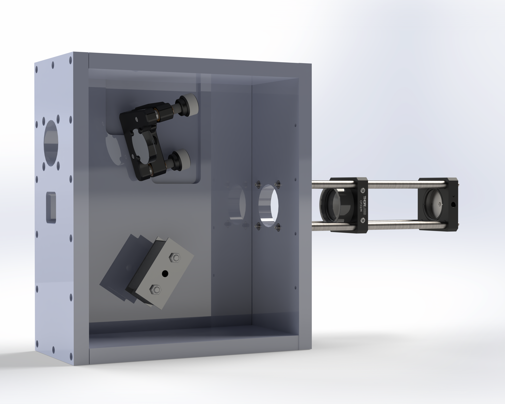
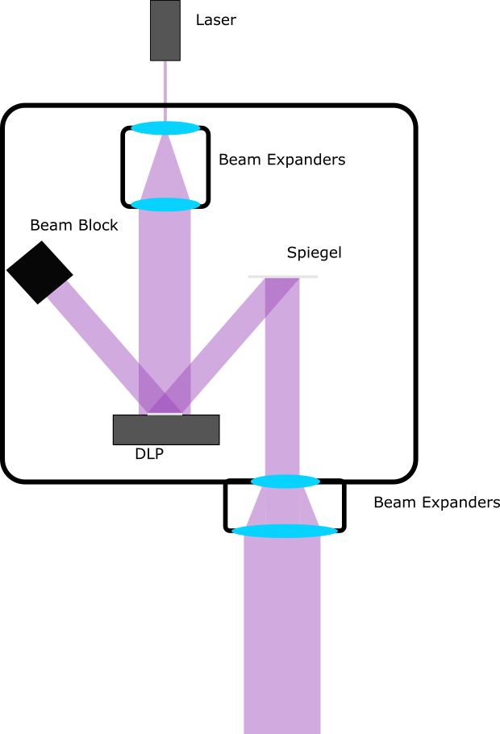

# Masterarbeit

## Modell

## Strahlengang

## DLP
* DLP LightCrafter Display 3010EVM-G2:
  * RES: 1280x720
  * Price: ~720€
  * https://www.ti.com/tool/DLPDLCR3010EVM-G2

## Optic Mounts
* ER6-P4 - Cage Assembly Rod, 6" Long, Ø6 mm, 4 Pack
  * Price: 30,78 €
  * https://www.thorlabs.com/thorproduct.cfm?partnumber=ER6-P4
 
* KM1CE - Ø1" Clear-Edge Kinematic Mirror Mount, 2 Adjusters 
  * Price: 45,25 €
  * https://www.thorlabs.com/thorproduct.cfm?partnumber=KM1CE

## Mirror
* PF10-03-F01 - Ø1" UV-Enhanced Aluminum Mirror
  * Price: 48,70 €
  * https://www.thorlabs.com/thorproduct.cfm?partnumber=PF10-03-F01
  
## Lense
* AC254-080-A-ML - f=80 mm, Ø1" Achromatic Doublet, SM1-Threaded Mount, ARC: 400-700 nm 
  * Price: 96,40 €
  * https://www.thorlabs.com/thorproduct.cfm?partnumber=AC254-080-A-ML
