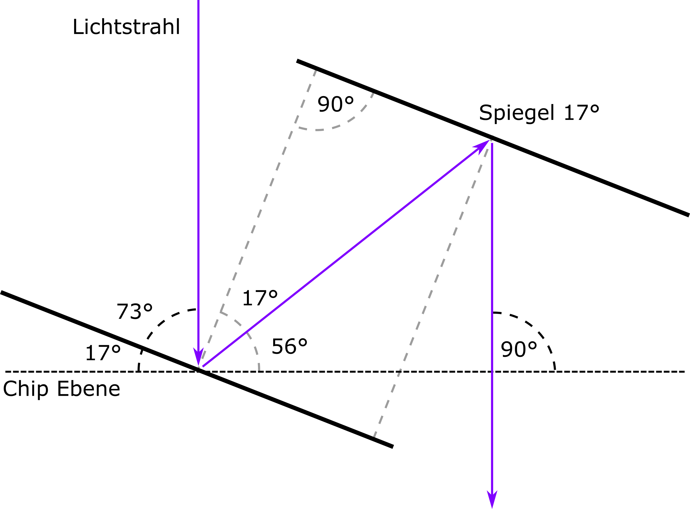

# Masterarbeit

## Modell
.png)

## Strahlengang

## DLP
* DLP LightCrafter Display 3010EVM-G2:
  * RES: 1280x720
  * Price: ~720€
  * https://www.ti.com/tool/DLPDLCR3010EVM-G2

* DLP® LightCrafter™ Display 2010 Evaluation Module 
  * RES 854 × 480
  * Price: ~520€
  * https://www.ti.com/tool/DLPDLCR2010EVM#technicaldocuments

## Beam Expanders
* GBE10-A - 10X Achromatic Galilean Beam Expander, AR Coated: 400 - 650 nm
  * Price: 400€ - 700€
  * https://www.thorlabs.com/newgrouppage9.cfm?objectgroup_id=1580

## Beam Block
* LB1/M - Beam Block, 400 - 700 nm, 10 W Max Avg. Power, CW Only, Includes TR75/M Post
  * Price: 50€
  * https://www.thorlabs.com/thorproduct.cfm?partnumber=LB1/M

## Optic Mounts
* CP33/M - SM1-Threaded 30 mm Cage Plate, 0.35" Thick, 2 Retaining Rings, M4 Tap
  * Price: 15,35 €
  * https://www.thorlabs.com/thorproduct.cfm?partnumber=CP33/M

* ER3-P4 - Cage Assembly Rod, 3" Long, Ø6 mm, 4 Pack
  * Price: 23,48 €
  * https://www.thorlabs.com/thorproduct.cfm?partnumber=ER3-P4

## Mirror
* PFSQ10-03-F01 - 1" x 1" UV-Enhanced Aluminum Mirror 
  * Price: 45,25 €
  * https://www.thorlabs.com/thorproduct.cfm?partnumber=PFSQ10-03-F01
  
## Lence
* AC254-080-A-ML - f=80 mm, Ø1" Achromatic Doublet, SM1-Threaded Mount, ARC: 400-700 nm 
  * Price: 96,40 €
  * https://www.thorlabs.com/thorproduct.cfm?partnumber=AC254-080-A-ML
